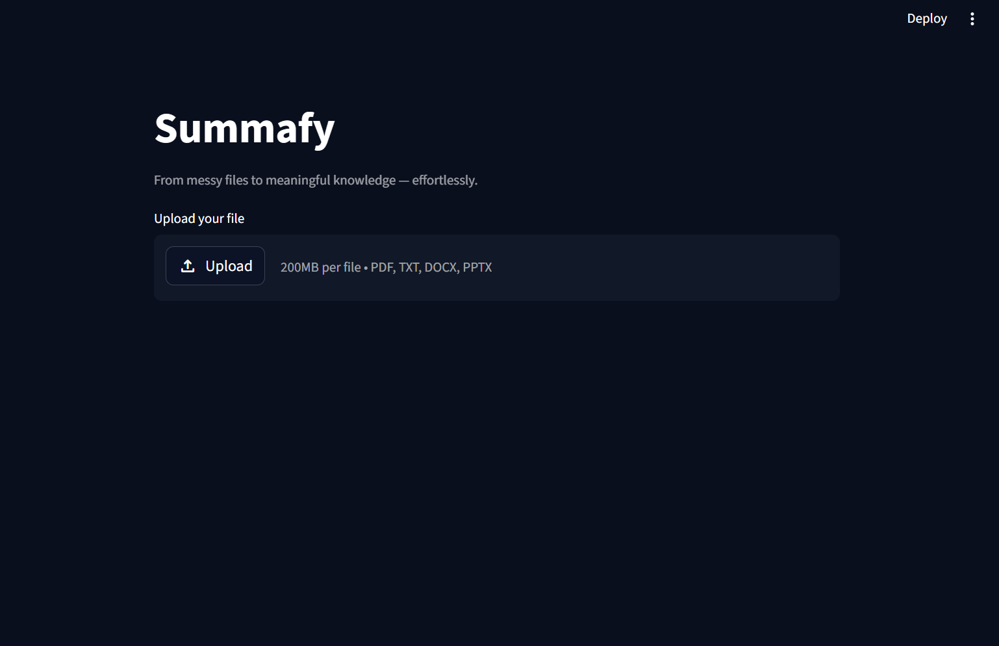
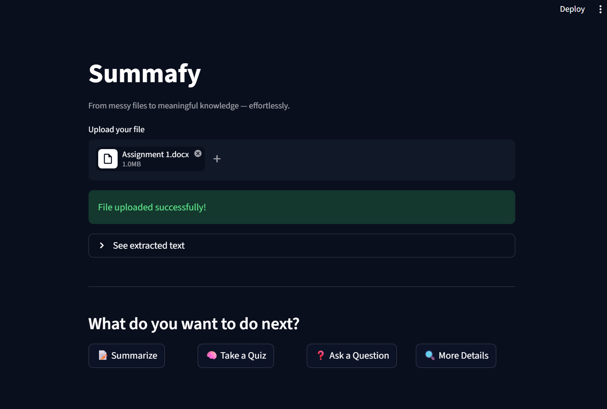
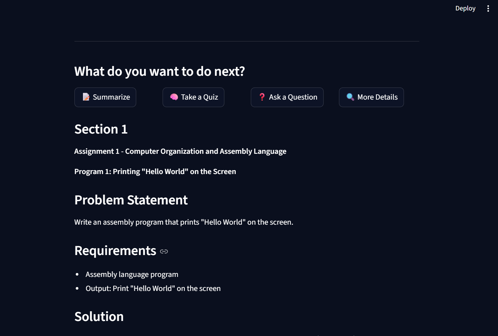
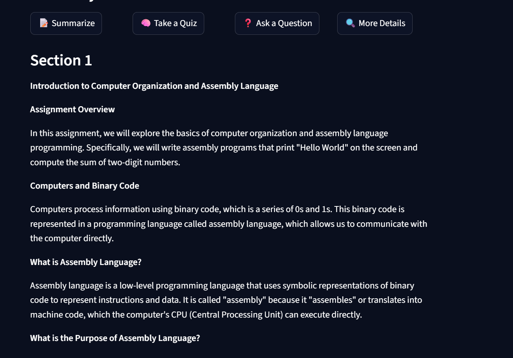

# Summafy 📄

> From messy files to meaningful knowledge — effortlessly.

Summafy is an AI-powered document assistant that reads your files and lets you summarize, quiz yourself, ask questions, and get deeper explanations — all in seconds.



---

## What It Does

Upload any document — PDF, Word, PowerPoint, or TXT — and choose what you want to do with it:

- **📝 Summarize** — Get a structured summary with headings and bullet points
- **🧠 Take a Quiz** — Generate MCQ questions from easy to hard to test your understanding
- **❓ Ask a Question** — Ask anything about the document and get a precise answer
- **🔍 More Details** — Expand every concept with examples, analogies, and deeper explanations



---

## Demo





---

## Built With

- **Python** — core language
- **Streamlit** — web interface
- **Groq API** — LLaMA 3.1 8B for AI responses
- **PyMuPDF** — PDF text extraction
- **python-docx** — Word document reading
- **python-pptx** — PowerPoint reading
- **python-dotenv** — secure API key management

---

## How It Works

1. User uploads a file
2. App extracts raw text using file-type specific readers
3. Text is split into chunks to handle large documents
4. Each chunk is sent to Groq's LLaMA model with a specific prompt
5. Response streams back in real time

---

## What I Learned Building This

- Reading different file types in Python — PDF, DOCX, PPTX, TXT
- **Chunking** — splitting large documents into pieces that fit within LLM context windows
- Streaming AI responses for better user experience
- Session state management in Streamlit
- Error handling for production-ready apps
- Prompt engineering for structured outputs

---

## Run Locally

**1. Clone the repo**
```bash
git clone https://github.com/EmaanInk/Summafy.git
cd Summafy
```

**2. Create virtual environment**
```bash
python -m venv venv
venv\Scripts\activate
```

**3. Install dependencies**
```bash
pip install -r requirements.txt
```

**4. Add your API key**

Create a `.env` file:

Get a free key at [console.groq.com](https://console.groq.com)

**5. Run**
```bash
streamlit run app.py
```

---

## Project Structure
Summafy/
├── app.py              # Main Streamlit app
├── file_reader.py      # File reading functions for all supported types
├── chunker.py          # Text chunking for large documents
├── requirements.txt
├── .env                # API key (never committed)
└── .gitignore

---

## Author

**Emaan** — CS student and AI engineer in the making.

- GitHub: [@EmaanInk](https://github.com/EmaanInk)
- LinkedIn: [https://www.linkedin.com/in/emaan-khan-476698407]

---

*Built as part of my AI engineering learning journey. Second project after CookBot.*